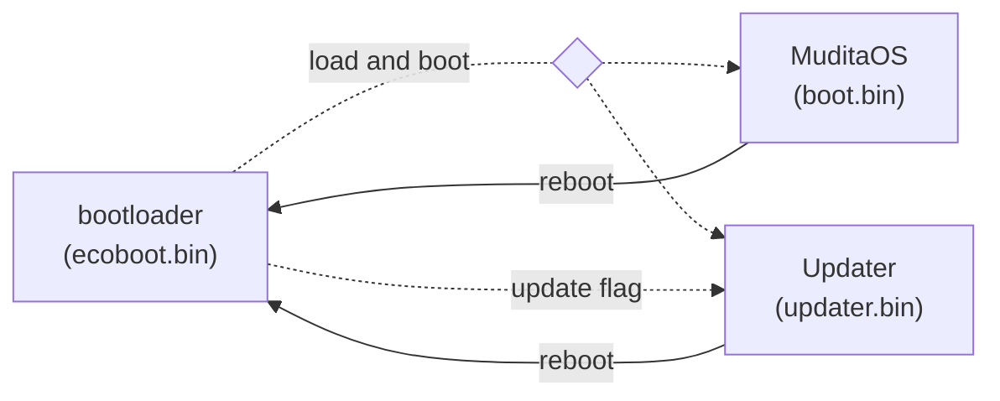
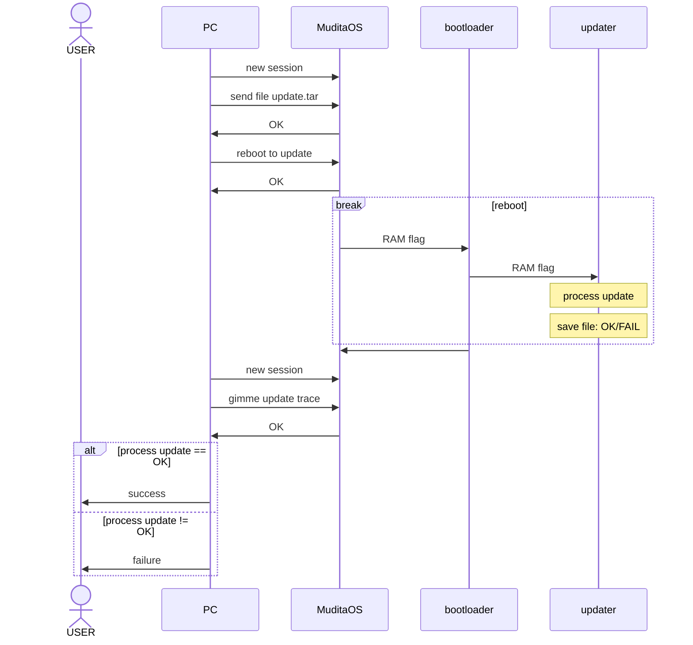

# How to boot Mudita Pure and create a storage partition

## General update architecture

There are two major ways to update the OS:

- via update utility
- via MMC access (only for internal development)

General applications interaction diagram:



Simplified flow:

- Bootloader always starts first
  - Then, depending on SNVS flag, it boots either:
    - updater
    - os
- Updater starts after ecoboot, then executes one of the procedures:
  - update
    - creates backup
    - updates the os
    - **synchronises changes on success**
    - reboots with clean boot flag
  - system recovery
    - restores last backup
    - **synchronises changes on success**
    - reboots with clean boot flag
  - factory reset
    - removes selected data
    - **synchronises changes on success**
    - reboots with clean boot flag
  - pgm keys programming
    - programs signkeys for bootloader and OS
    - reboots with clean boot flag
  - reboot with clean boot flag
    - reboots with clean boot flag
- OS, from update perspective
  - accepts tar update package
  - reboots the OS with SNVS flag set to update
  - **nothing more**

> [!IMPORTANT]
> The updater is, by design:
>
> - as OS-agnostic as possible
> - as simple as possible
> - does only one procedure at a time with fail-fast approach
> - procedural software with:
>   - short update trace
>   - that exits on first error
>   - with easy to pin point failure in the trace

### How user update works - overview of the user flow



### TL;DR; What updater provides

1. update
2. restore: from last update to previous system version
3. factory reset: it only cleans data, does not restore factory OS

### Why is the updater a separate application

To assert that the process is fully separated from the OS and as abstract from the
hardware as possible and finally as simple the update process was designed as
above.

## Quick and dirty way of how to debug update issues

1. download update package
2. run the update
    - easiest with `QAMuditaOS` i.e. :

      ```bash
      python -m pytest ./scenarios/updater/test_load_update.py -s --update_package=/home/pholat/Downloads/PurePhone-1.2.1-rc.1-RT1051-Update.tar`
      ```

3. see the trace result on either:
    - trace file on the disk
    - uart console from the phone

    Trace file have explicitly:
    - in what file & line line issue occured
    - which procedure failed
    - what was the procedure error
    - what was the procedure extended error

    i.e. `t:10,name:"checksum_verify:/os/tmp/updater.bin",err:1,ext_err:88,err_cstr:"ChecksumInvalid",file:"/home/jenkins/workspace/PureUpdater_release_builder_-_signed/PureUpdater/updater/procedure/checksum/checksum.c",line:89,opt:checksum mismatch:  : 94bbac3d04632172584d4cb5fd3c21bb`
4. debug via:

    `./run.sh`

    *OR*

    load updater.bin

    *OR*

    from the example: check why there is no checksum in the first place
        - check if file with checksum exists
        - check if it has checksum in it

    Then:
      - if there is no checksum, **FIX IT** on the CI/locally (for local builds)
      - if there was a checksum, and the updater failed **FIX IT** in the updater

5. status is always in 3:/updater.log
6. There is no crash log, if it was to be added - then it should be added with upmost care to not i.e. depend on non existing filesystem into separate crash dump file.

## Booting Mudita Pure

To follow these steps please make sure that you have the latest `ecoboot` bootloader on the phone. We recommend [version 1.0.4](https://github.com/mudita/ecoboot/releases/tag/1.0.4) which will work even if you manage to break the filesystems in the next steps (it's goot to be prepared).

1. `ecoboot` reads `/.boot.json` and `/.boot.json.crc32` and verifies if `crc32` in `/.boot.json.crc32` matches the actual `crc32` of `/.boot.json`

2. If `ecoboot` can't read `/.boot.json` and/or `/.boot.json.crc32` it tries to read `/.boot.json.bak` and `/.boot.json.bak.crc32` and verifies the checksum of `/.boot.json.bak`. If the `/.boot.json.bak` file passes the checksum test ecoboot should fix `/.boot.json` and `/.boot.json.crc32` files so that MuditaOS can pick up what version is booted (not implemented, ecoboot will fallback to booting /sys/current/boot.bin).

3. If both above steps fail, `ecoboot` reads `/sys/current/boot.bin` and loads it (failsafe)

4. `boot.json` contains the filename to load in a simple INI format

    ```json
    {
        "main":
        {
            "ostype": "current",
            "imagename": "boot.bin"
        },
        "bootloader":
        {
            "version":"0.0.0"
        },
        "git": {}
    }
    ```

    There should be 2 instances of the MuditaOS on the phone (`/sys` is assumed at vfs class creation time).

    ```
    "current"  -> /sys/current  
    "previous" -> /sys/previous  
    ```

    The type variable in `boot.json` is for MuditaOS - this will indicate a subdirectory name to append for all file operations (loading assets, dbs, etc.) When the option becomes possible, it should be passed as a variable to the `boot.bin` (MuditaOS) as an argument.

5. `ecoboot` boots the "**boot**" filename in `boot.json`. MuditaOS reads `boot.json` to find it's root directory and reads all assets and files from it.

6. Updating from old style partitioning (1 partition) to new partition scheme (2 partitions). In case of problems see pt 6.

## Creating a storage partition

1. Switch the phone to MSC mode (bootloader option 4)

2. Unmount disk from the OS so that it's not used

3. Find the disk name that is assigned to the phone (sda, sdb etc.)

4. Find out if the disk is mounted (assuming /dev/sda)

    ```bash
    [atom@nucleus:~/devel/PurePhone_14/doc]$ cat /etc/mtab | grep /dev/sda | awk '{print $2}'
    /mnt
    ```

5. Unmount `/dev/sda` from `/mnt` before you do anything else

    ```bash
    sudo umount /mnt 
    ```

6. Move into the project root directory and run the image generation script

    ```bash
        ./generate_image.sh pure.img build-rt1051-Debug
    ```

   Example output:

    ```bash
    Checking that no-one is using this disk right now ... OK

    Disk /home/lucck/worksrc/MuditaOS/pure.img: 14,62 GiB, 15678308352 bytes, 30621696 sectors
    Units: sectors of 1 * 512 = 512 bytes
    Sector size (logical/physical): 512 bytes / 512 bytes
    I/O size (minimum/optimal): 512 bytes / 512 bytes

    >>> Script header accepted.
    >>> Script header accepted.
    >>> Script header accepted.
    >>> Created a new DOS disklabel with disk identifier 0x09650eb4.
    /home/lucck/worksrc/MuditaOS/pure.img1: Created a new partition 1 of type 'W95 FAT32' and of size 1 GiB.
    /home/lucck/worksrc/MuditaOS/pure.img2: Created a new partition 2 of type 'W95 FAT32' and of size 1 GiB.
    /home/lucck/worksrc/MuditaOS/pure.img3: Created a new partition 3 of type 'Unknown' and of size 12,6 GiB.
    /home/lucck/worksrc/MuditaOS/pure.img4: Done.

    New situation:
    Disklabel type: dos
    Disk identifier: 0x09650eb4

    Device                                 Boot   Start      End  Sectors  Size Id Type
    /home/lucck/worksrc/MuditaOS/pure.img1 *       2048  2099199  2097152    1G  b W95 FAT32
    /home/lucck/worksrc/MuditaOS/pure.img2      2099200  4196351  2097152    1G  b W95 FAT32
    /home/lucck/worksrc/MuditaOS/pure.img3      4196352 30621695 26425344 12,6G 9e unknown

    The partition table has been altered.
    Syncing disks.
    Littlefs summary:
        Directories created: 5, Files added: 24, Transferred 1198 kbytes.
              Littlefs block size: 32768 blocks: 57/412895.
              /home/lucck/worksrc/MuditaOS

    ```

7. Once completed, flash the phone with the latest MuditaOS build. To do that run the `pureflash` command on the image:

    ```bash
    sudo pureflash pure.img /dev/sdX
    ```

    > [!NOTE]
    > Replace `/dev/sdX` with the disk name you found for your phone after connecting it to your computer.

    Example output:

    ```bash
    ➜  build-linux-Debug git:(EGD-6188_flashing_script) ✗ ./pureflash ~/worksrc/MuditaOS/build-rt1051-RelWithDebInfo/PurePhone.img /dev/sda 
    File /home/lucck/worksrc/MuditaOS/build-rt1051-RelWithDebInfo/PurePhone.img copy 7 extents:
    #       Offset          Length           Status
    0:      0000000000000000 0000000000001000 OK
    1:      0000000000100000 0000000000001000 OK
    2:      0000000000104000 0000000000a2d000 OK
    3:      0000000040100000 0000000000001000 OK
    4:      0000000040104000 0000000000200000 OK
    5:      0000000080100000 0000000000010000 OK
    6:      0000000320e20000 00000000001c0000 OK
    File /home/lucck/worksrc/MuditaOS/build-rt1051-RelWithDebInfo/PurePhone.img verify 7 extents:
    #       Offset          Length           Verify
    0:      0000000000000000 0000000000001000 OK
    1:      0000000000100000 0000000000001000 OK
    2:      0000000000104000 0000000000a2d000 OK
    3:      0000000040100000 0000000000001000 OK
    4:      0000000040104000 0000000000200000 OK
    5:      0000000080100000 0000000000010000 OK
    6:      0000000320e20000 00000000001c0000 OK
    Write image /home/lucck/worksrc/MuditaOS/build-rt1051-RelWithDebInfo/PurePhone.img to /dev/sda SUCCESS
    ➜  build-linux-Debug git:(EGD-6188_flashing_script) ✗ 
    ```
